# Index

- [Introduction](#introduction)
- [First Approaches](#first-approaches)
  - [Data Preprocessing](#data-preprocessing)
  - [Transformer Model](#transformer-model)
    - [Code and Diagram](#code-and-diagram)
    - [Training and Evaluation](#training-and-evaluation)
  - [Chunking Approach](#chunking-approach)
  - [Convolutional Approach](#convolutional-approach)
    - [Code and Diagram](#code-and-diagram-1)
    - [Training and Evaluation](#training-and-evaluation-1)
  - [Conclusion First Approaches](#conclusion-first-approaches)
- [Second Approach: MiMi Embeddings](#second-approach)
  - [Data Preprocessing and Augmentation](#data-preprocessing-and-augmentation)
  - [Initial Learnings + Weights and Biases](#initial-learnings--weights-and-biased)
  - [MiMi + MLP Classifier](#mimi--mlp-classifier)
    - [Code and Diagram](#code-and-diagram-2)
    - [Training and Evaluation](#training-and-evaluation-2)
  - [MiMi + Transformer Classifier](#mimi--transformer-classifier)
    - [Code and Diagram](#code-and-diagram-3)
    - [Training and Evaluation](#training-and-evaluation-3)
  - [MiMi + XGBoost](#mimi--xgboost)
- [General Conclusions](#general-conclusions)
- [Questions](#questions)
  

Note: All code can be found on **src** folder. 

# Introduction
The purpose of this report is to explain the multiple approaches that were tried in order to find the best possible solution given the limited dataset.
There were **two main approaches**, using **mel-spectograms** and using the **embeddings produced by Mimi**, an audio encoding model. The second approach clearly yield better results. I will start commenting the first approach. Feel free to jump straight to the second approach, general conclusions and questions answering.

All experiments were conducted on my laptop, which has an NVIDIA GeForce RTX 4060 with 8GB of VRAM. I conducted more than **40 different experiment**s with **multiple runs in each experiment**. The idea is to find a model that performs decently with this dataset so we could extrapolate it to a bigger one.

Weights and biased were used to track most of the experiments. During one day I did not use weight and biased and chose to plot things locally as my wifi went down for 6 hours.

# First approaches

## Data preprocessing

Created mel-spectograms using librosa. For the mel spectograms i used window lenght of 25ms and hop_lenght of 10ms.  I chose mel spectrograms because they approximate the way human auditory perception works by compressing the frequency scale to emphasize more perceptually relevant information in the lower frequencies while reducing sensitivity to less important high frequency details. Mel spectograms what for example Whisper uses as input.

Here is an example:

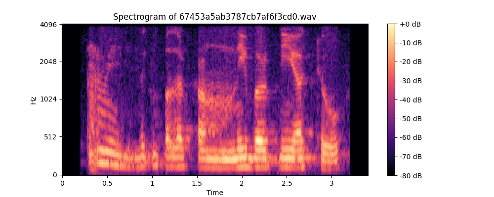

Multiple mel_bins sizes were tried to assess their effect on model performance. No significant difference was found between 32,64 and 128.

Code can be seen on **EOSDataset** class in the models

## Transformer model

### Code and diagram

Check the code at **transformer_no_chunking.py**

### Training and evaluation

With all the spectograms, a transformer based model for feature extraction with a MLP classifier was trained using 80% of the data for training and 20% of the data for testing.

As the dataset is really small, the testing accuracy could be sensitive to the particular split of training and testing data. Even more if different samples belong to the same speaker, which is the case.   

To mitigate this and to get stable metrics, I ran 100 simulations with random train/test splits. In each simulation, the model was trained for 60 epochs, and the highest testing accuracy across epochs was selected as the representative score. You can think of this as a **"monte carlo cross-validation"** strategy, aimed at capturing variance due to different train/test configurations.

The **average accuracy** was **54.55%**. Below we can see a spectogram of the distribution of the accuracies:

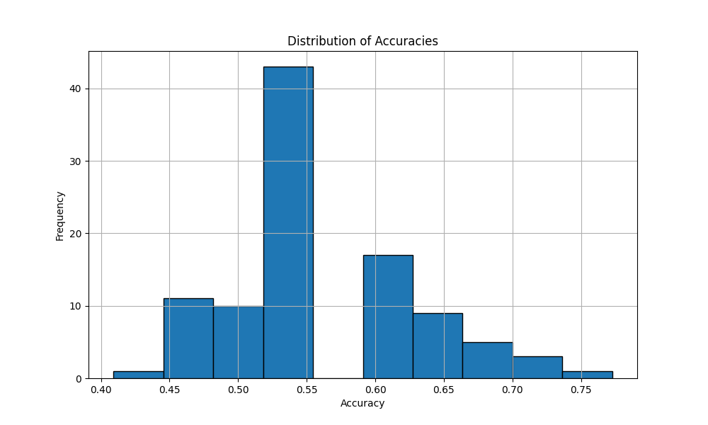

As you can see the average doesn't lie. The model has high variance which means that the performance varies significantly across different data splits. This implies the model is not learning a generalizable representation. So, the occasional 0.75 accuracy observed in some runs could be attributed to lucky train/test splits or lucky initializations rather than to model robustness.

Multiple bath_sizes, learning_rates, weight_decays and dropouts were tried to improve the model with no significant difference.

It is still positive that we got above randomness rounds. This means that there is room for improvement and that probably with a bigger dataset we could see more robustness.

Still, the model has high variance, and further testing with bigger dataset will be needed to assess the generalization capabilities.

## Chunking approach
You can check the code at **transformer_chunking_kfold**.

To explore another approach I split each spectrogram into X temporal chunks (different values of X were tested). The goal was to artificially increase the dataset size by generating multiple training examples from each audio file. This leads to a class imbalance, where most chunks are non-EOS as only the final chunk of an audio is labeled as "end of sentence" (EOS). However, given that EOS events are also rare in real conversations, my hypothesis was that this imbalance could help improving the results.

I ensured that all chunks from the same original audio were assigned to the same split, preventing chunks of the same file from appearing in both training and test sets.

The classifier architecture remained the same as in the non-chunked model. For evaluation, only the last chunk of each test audio was used to calculate accuracy, since it reflects the decision point for EOS detection. This time, I used 5-fold cross-validation instead of random train/test splits. Performance was worst than in the previous approach with 50% avg accuracy.

## Convolutional approach

I tried a convolutional network to extract features from the mel-spectograms followed by a simple classifier. The idea was that the convolution could detect short term relationships between different frequency bands and times.

### Code and diagram
You can check the code at **convolutional.py**.

### Training and evaluation
Same approach as in the transformer model was followed, with the same number of simulations. Average accuracy across the 100 attemps was **55.05%**. There is no significant difference and the conclusions are the same as on the transformer approach.

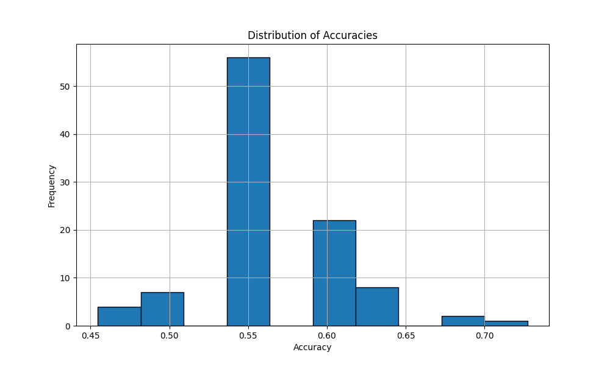

## Conclusion first approaches
Overall, these results highlight that while mel-spectrogram-based models can detect signals related to sentence boundaries, more consistent performance will likely require a larger dataset so the transformer or convolutional network can learn meaningful features for the classifiers.

# Second approach
Inspired by previous attempts and as 100 audios are not enough to train a model to extract meaningful features, I opted for using an already pretrained codec called **Mimi**, particularly the encoder and the quantizer decoder, which comes from the Moshi paper from Kyutay labs. 

Mimi transforms 24 khz audio waveforms into discrete latent tokens at a frame rate of 12.5 Hz, 8 tokens per frame. Each token corresponds to a 512 dimensions embedding. One thing that sets Mimi apart is that the first of this tokens holds semantic meaning while the rest hold acoustic meaning. My hypothesis was that these high quality embeddings, especially the semantically first token, could provide enough structure and signal to improve classifier performance.

After Mimi's embeedings, 3 classifiers were tried: A transformer, an MLP and also a non deep learning approach, XGBOOST. There was a clear improvement respect approach one.

## Data preprocessing and augmentation

To address the small dataset size and hypothetically improve model robustness I used some data augmentation techniques at the audio level. By doing so we passed from 109 datapoints to 436. The augmentation techniques were:

<ul>
  <li>Adding gaussian noise to the audio trying to simulate background noise</li>
  <li>Slowing down the audio by a factor of 0.8</li>
  <li>Making variations to the audio pitch</li>
</ul>

To avoid artificially inflated performance, I ensured that each augmented sample and its corresponding original audio were always assigned to the same split, either training or testing, but never split between the two. 

After the augmentation, all audios were passed across Mimi's encoder and the quantizer decoder to get the embeddings for each audio. This embeddings were save on disk to avoid recomputing them in each run. You can find them in **mimi_embeddings** folder and the augmented version on **augmented_mimi_embeddings** 

Here is a visualization of MiMi embeddings projected into 2D using t-SNE. The visualization can be found on **visualize_embeedings.py**

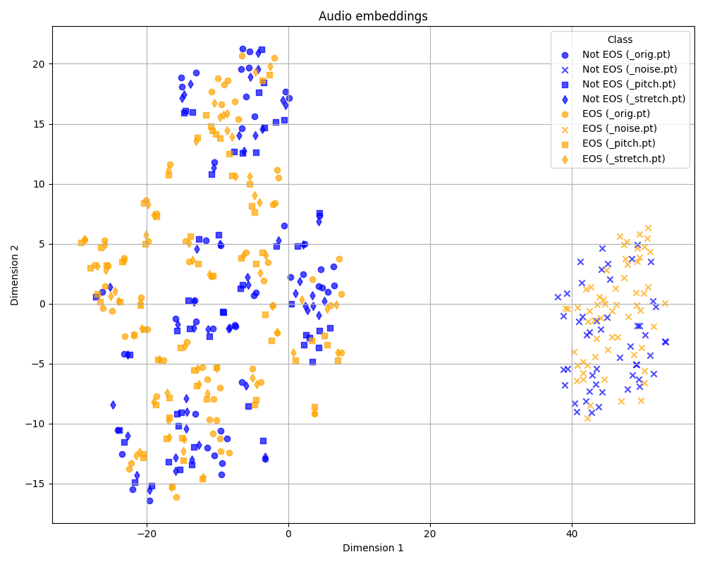

There are two observations:

  <li>For each original sample, its pitch-shifted and time-stretched versions tend to form triplets with its original. This suggests that Mimi is focusing on the semantic similarity and does not find the acoustic difference significant. When adding gaussian noise, in contrast, Mimi finds the acoustic difference significant. Later i will comment how data augmentation did not help or even worsen the models</li>
     
  <li>Although the two classes (blue = Not EOS, orange = EOS) are not linearly separable in 2D, which is expected since MiMi was not trained for end of sentence detection, we can still observe localized clusters of the same label. These bounded regions may suggest that in higher dimensions, the separation might be more structured and a non-linear classifier could potentially identify patterns.</li>
</ul>
    
## Initial learnings + Weights and biased 

I used weights and biased to monitor the different experiments and to get useful metrics. Here you can see how my dashboard looked:

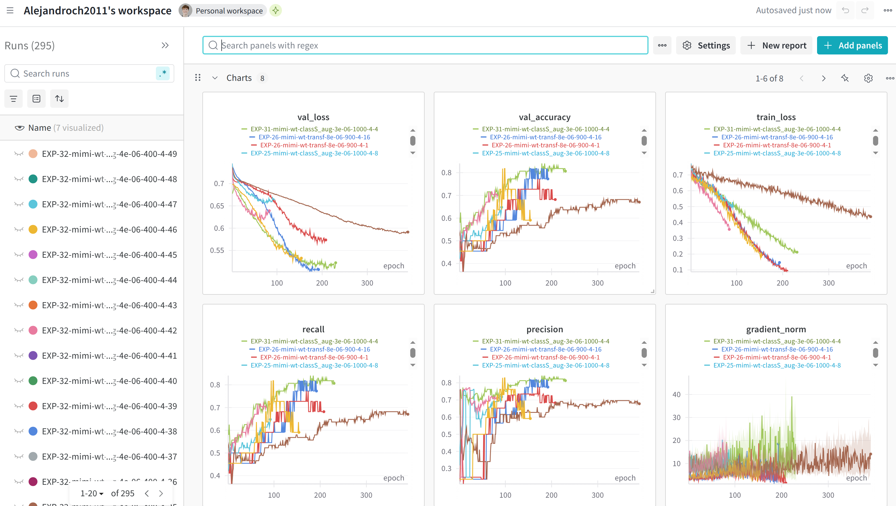

Thanks to a higher perspective I was able to determine:

1. That my first classifiers were overfitting because they were to big, so i reduced them.

2. That i needed to tune the learning rate, dropout and weight decay to obtain more stable trainings. I also tried using a learning rate scheduler which was not significant.

The following image showcases points 1 and 2:

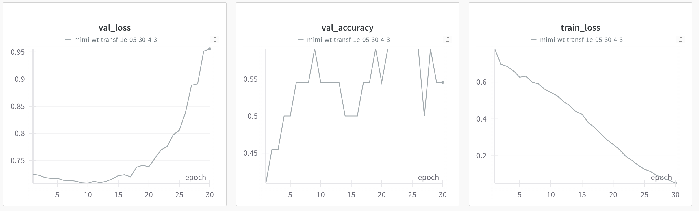

3. That there were some runs that behaved much better than others, which led me to do multiple simulations with the same conditions to get average metrics that truly reflect the robustness of each model (i also did this on approach 1)

The following image show the variance on the same model. Each example has a different train/test split

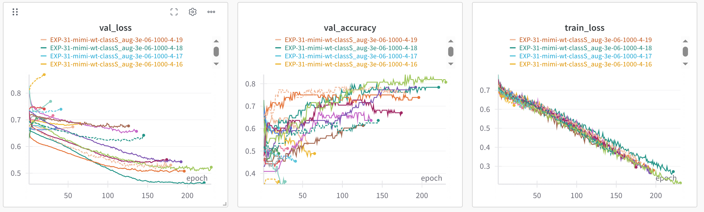

## Mimi + MLP classifier

### Code and diagram

You can check the code at **mimi_mlp.py**

### Training and evaluation

To get robust metrics as in approach one, I ran 100 simulations with random train/test splits. In each simulation, the model was trained for 60 epochs, and the highest testing accuracy across epochs was selected as the representative score.

Note: Recall, precision and f1 score were also calculated but not shown to avoid an ultra long report

**Results with no data augmentation: avg accuracy of 67,18% with 0.01 variance**

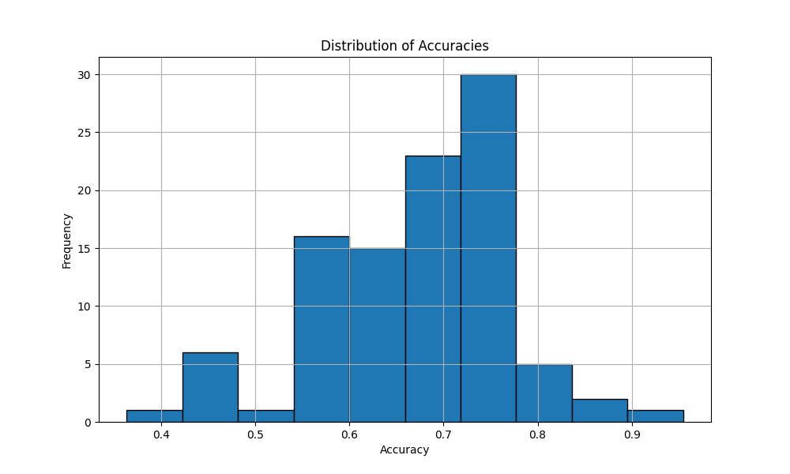

**Results with data augmentation (noise): avg accuracy of 66% with 0.01 variance**

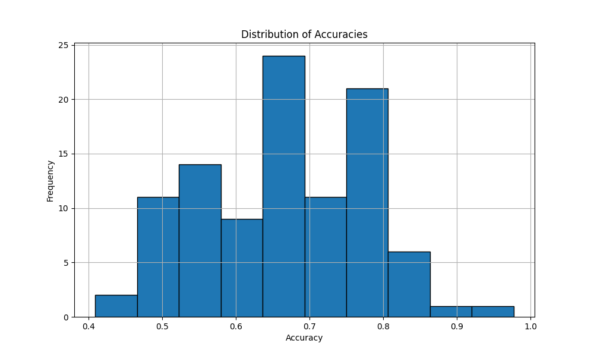

**Results with data augmentation (pitch speed and noise): avg accuracy of 63,23% with 0.008 variance**

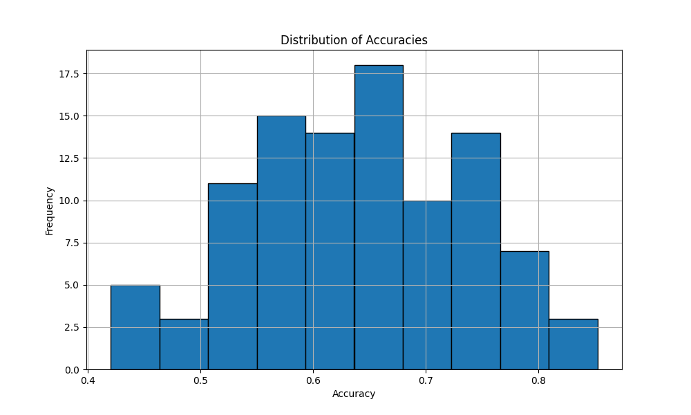

**Results with data augmentation (pitch and speed): avg accuracy of 63,82% with 0.0054 variance**

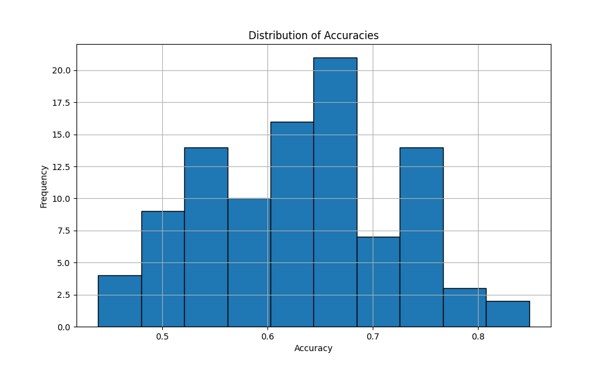

Unexpectily, data augmentation did not help improve the model. It would be brave to say they decreased it, statistical test will be needed, but certainly they did not improve it.

Also, we can see some runs that archived over 90% accuracies on the testing split. Due to the variance of the results, we can not assume that the 90% accuracy model will have that performance on a real scenario, as the testing split is small and may not capture the full distribution of real data, so it could just be luck. It is more prudent to stay with the 67% average accuracy across the 100 simulation.

This it is positive as suggest that with sufficient data, this model may be able to learn better.

Here is a confusion matrix done at a model with 67% test accuracy:

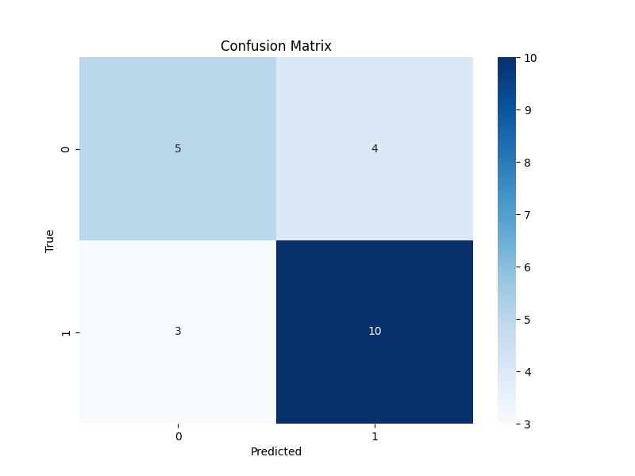

## Mimi + Transformer classifier

### Code and diagram

You can check the code at **mimi_with_transformer.py**

### Training and evaluation

**Results with no data augmentation: avg accuracy of 66,82% with 0.01 variance**

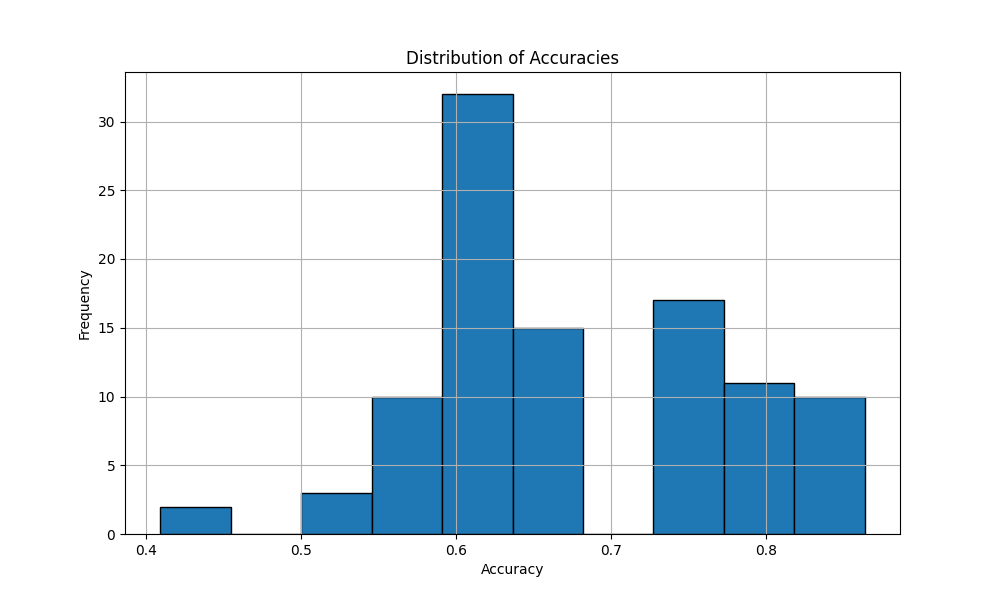

**Results with data augmentation (noise): avg accuracy of 64.23% with 0.009 variance**

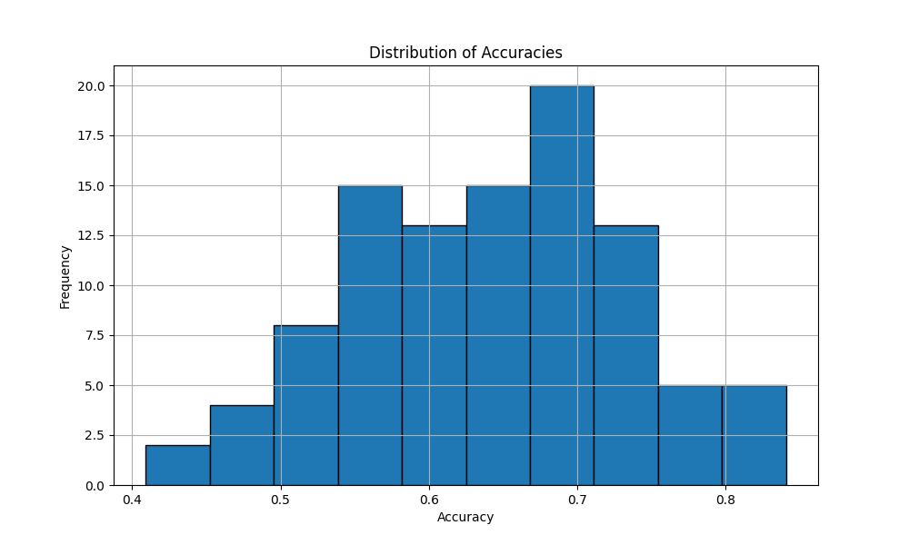

**Results with data augmentation (pitch speed and noise): avg accuracy of 64,66% with 0.0054 variance**

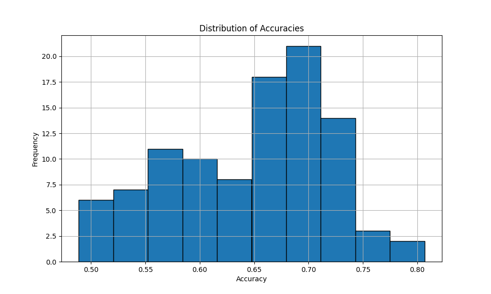

**Results with data augmentation (pitch and speed): avg accuracy of 64,45% with 0.0077 variance**

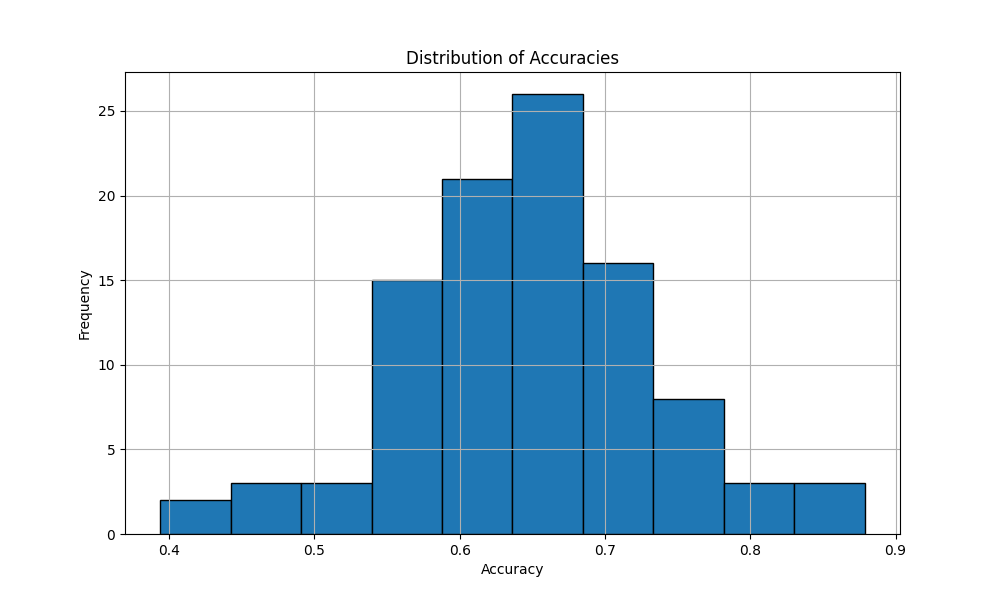

Same conclusions as with the MLP classifier can be extracted. The transformer classifier performed 1% point worst than the MLP classifier (both with no data augmentation)

## Mimi + XGBOOST

To explore a non-deep learning alternative I used an XGBoost classifier, which is a gradient-boosted decision tree algorithm. The input to XGboost was a mean pool over the temporal dimension of the audio embeddings.

I ran the same 100 run monte carlo evaluation strategy as in the MLP approach, both with and without data augmentation. You can find the implementation in **mimi_xgboost_sim.py**.

To optimize performance, I performed a grid search over the hyperparameter space of the classifier. This grid search is implemented in **mimi_xgboost_grid.py**, and the best parameters found were used in the final evaluations.

**Results with data augmentation: avg accuracy of 64,77% with 0.0065 variance**

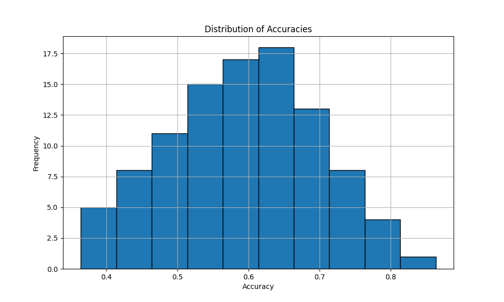

**Results with no data augmentation: avg accuracy of 63,64% with 0.009 variance**

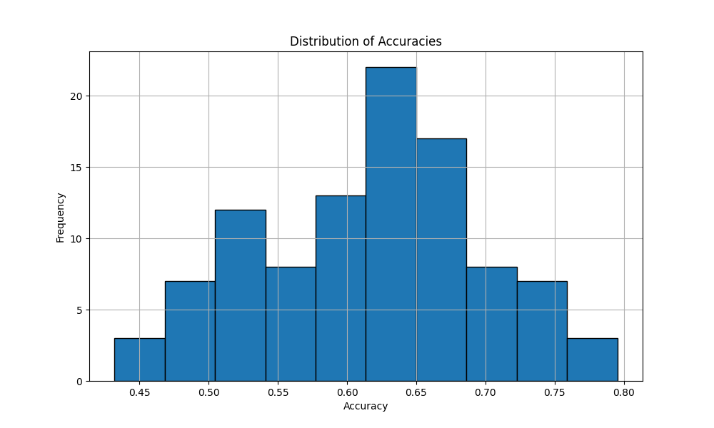

Performance was worst than in the deep learning approaches.

# General conclusions

<ul>

<li>Using MiMi embeddings resulted in higher accuracy than mel-spectrogram-based models. While spectrogram models reached ~54% (this could be seem as random accuracy), MiMi-based models achieved up to 67% average accuracy. This shows that using pretrained audio encoders can extract more meaningful features, especially when training data is scarce. </li>
<li>Contrary to expectations data augmentation techniques such as adding noise, changing pitch, or slowing audio did not improve model performance. In some cases it even reduced accuracy.   </li>
<li>Among all models tested, the MiMi + MLP classifier with no data augmentation yielded the best results, achieving 67.18% average accuracy. It outperformed the transformer and XGBoost classifiers, making it the most promising candidate for deployment, given the current data. Still transfomer was close behind   </li>
<li>The dataset's small size (only 109 audio clips) led to high sensitivity to train/test splits and model initialization. To mitigate this, I used 100-run monte carlo cross-validation to estimate robust metrics. Still, a larger dataset is needed to properly assess generalization and reduce the variance caused by random sampling.  </li>

<li>Some individual runs achieved over 90% test accuracy, though these are likely due to lucky splits or initializations. However, they provide evidence that the task is learnable and that with more data models could generalize better. The current results offer a strong baseline and justify further data collection and experimentation.</li>
</ul>

# Questions

**How do you feel about classifying each chunk in the sentence in an isolated manner?**

Classifying each chunk in isolation is beneficial for performance as smaller chunks mean faster processing (specially in transformer architectures) and lower memory usage. However, my intuition is that with less context it becomes harder for the model to detect patterns that indicate the end of a sentence.

**Would it be better to aggregate previous non-ended chunks to give it more context? If so, wouldn’t we be introducing an inductive bias that the longer the audio chunk, the higher the probability of it being ended?**

I think it would likely improve performance as for example a person might make multiple pauses before ending. There are patterns that might only be detected on longer audios. 

The concern about introducing an inductive bias is valid. If longer chunks are more likely to be labeled as "end of sentence" the model might learn a shortcut to get them right. This could hurt generalization like when a user says a short sentence.

On the other hand this bias could also help as I beleive it is true that the longer a person talks the more likely it is that it will end the sentence soon.

I would handle this with care. I think we should still pass varying chunk lengths with a good distribution of EOS and not EOS so the model doesn't take the shortcut for longer sentences. This way the model can learn that EOS can happen at any time and that there are other signals (not just time) that signal the end. However in the dataset there are 1 second audios, maybe that is too short.

**The final outcome of this model is to determine if the LLM should trigger in and generate a response. Can we achieve this just by looking at the audio?**

Yes, in many cases. This has been proven in the experiments i did before in approach 2, and with a larger dataset it will probably perform better. 

However, maybe to get better performance a semantic input is also useful. In fact I believe one of the advantages of my second approach is that Mimi capturing semantic meaning on the first embedding helped with the classification task

**Should this classifier also have access to the transcript and context about the conversation to better inform its decisions? In your mind, what would be the ideal input for the model? For example, a sales rep working in freight knows that a load number is typically longer than 6 numbers. Therefore, if the person says 2 numbers, it’s clear that it hasn’t ended. How do you inject this context to this model?**

Having access to this information will probably improve the decision making, but they would also introduce and overhead as more processing is needed, so there is an interesting trade-off.

In an ideal world without latency concerns, the whole conversation plus the additional context of each case like the typical load number length must be inputed into the model as well.

I would avoid transcribing conversations for EOS detection as that introduce a lot of latency. (Maybe with Groq or Cerebras we could get rid of the latency concern?). From what I understand about Happyrobot’s architecture the EOS  detection runs before the transcription.  It is also possible that you're always transcribing in parallel, and performing EOS detection continuously as well but only triggering the agent's response once EOS is detected. In this case the transcriptions could be reused for EOS, still a call to an LLM adds latency.

To inject the conversation into the audio, I would use embeddings generated by the encoder of a language model. We could mix this semantic embeddings with the embeddings of the audio produced by a encoder like Mimi or Whisper using cross attention or concatenation to give more context into the classifier. 

Again, the simpler the model the less latency, which is a concern for Happyrobot. Optimizing for latency will also be a priority

**Should this model only provide some metadata and let the LLM decide?**

I would not rely only on an llm as it is missing all the acoustic information.